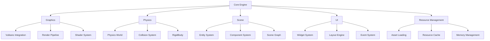
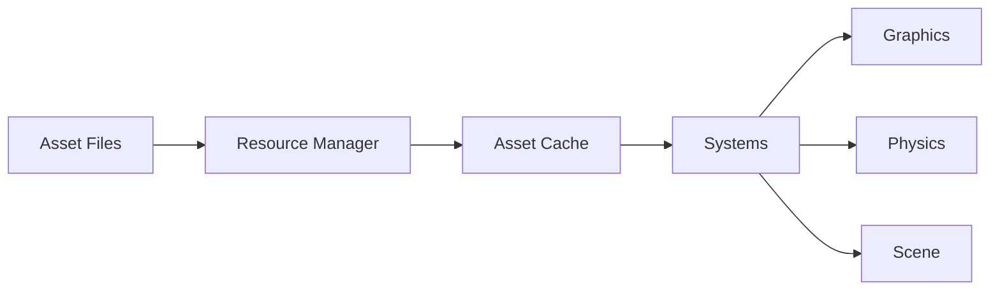

# Engine Architecture Overview

## Core Architecture



## Design Philosophy

### 1. Modular Design

- Each system is self-contained
- Clear interfaces between systems
- Minimal cross-system dependencies
- Pluggable components where possible

### 2. Safe Abstractions

- Safe wrappers around unsafe code
- Strong type system usage
- Error handling through Result types
- Resource management through RAII

### 3. Performance Focus

- Zero-cost abstractions where possible
- Efficient memory management
- Cache-friendly data structures
- Multi-threading support

## System Interactions

### Graphics Pipeline

```rust
// Core rendering flow
Window -> SwapchainAcquisition -> CommandBufferRecording -> Rendering -> Present
```

### Physics Integration

```rust
// Physics update cycle
PhysicsWorld -> BroadPhase -> NarrowPhase -> Solver -> Integration
```

### Scene Management

```rust
// Scene update flow
SceneGraph -> ComponentUpdate -> SystemUpdate -> RenderPrep
```

## Resource Flow



## Memory Management

### Resource Lifecycle

1. Load Request
2. Memory Allocation
3. Resource Loading
4. Reference Counting
5. Automatic Cleanup

### Memory Hierarchy

```
Stack
|- Temporary Allocations
|- Command Buffers

Heap
|- Long-lived Resources
|- Scene Data
|- Asset Cache
```

## Threading Model

### Main Thread

- Window management
- Event processing
- Render command submission

### Worker Threads

- Physics simulation
- Asset loading
- Scene updates

## Error Handling

### Error Propagation

```rust
pub enum EngineError {
    Graphics(GraphicsError),
    Physics(PhysicsError),
    Resource(ResourceError),
    Scene(SceneError),
}
```

### Recovery Strategies

1. Graceful degradation
2. Resource reloading
3. State reset capabilities

## Future Considerations

### Planned Features

- Advanced rendering techniques
- Extended physics capabilities
- Editor integration
- Asset pipeline improvements

### Scalability

- Support for large scenes
- Streaming capabilities
- Dynamic resource management
- Multi-threaded updates

### Cross-Platform

- Platform abstraction layer
- Multiple graphics backends
- Input system abstraction
- File system abstraction

## Best Practices

### Code Organization

- Clear module boundaries
- Consistent naming conventions
- Documentation requirements
- Unit test coverage

### Performance Guidelines

- Batch similar operations
- Minimize state changes
- Use appropriate data structures
- Profile critical paths

### Safety Guidelines

- Validate all inputs
- Handle all error cases
- Use safe abstractions
- Document unsafe code

## Development Workflow

### Feature Implementation

1. Design review
2. Implementation plan
3. Unit tests
4. Implementation
5. Integration tests
6. Documentation
7. Performance validation

### Code Review Process

- Architecture compliance
- Performance implications
- Error handling
- Documentation completeness

## Metrics

### Performance Targets

- Frame time: < 16ms
- Physics step: < 5ms
- Asset loading: Async
- Memory usage: Configurable limits

### Quality Metrics

- Test coverage: > 80%
- Documentation coverage: 100% public API
- Zero unsafe code warnings
- Clean clippy output

This architecture document serves as a living guide for development. Update as the engine evolves and new requirements emerge.
