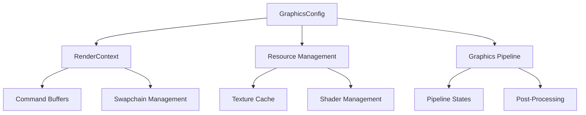

# Graphics Engine Improvements

## Recent Improvements

### 1. Configuration Management System

- Added a centralized configuration system via `GraphicsConfig`
- Configurable parameters:
  - Graphics quality settings (MSAA, anisotropic filtering, shadows)
  - Camera settings (FOV, clip planes, clear color)
  - Resource management (memory budgets, texture caching)
  - Debug options
  - Performance settings

### 2. Render Pipeline Enhancements

- Configurable MSAA support
- Flexible frame management
- Improved camera configuration
- Support for graphics quality presets

## Planned Improvements

### 1. Resource Management

- [ ] Implement texture caching system
- [ ] Add shader hot-reloading
- [ ] Memory usage monitoring
- [ ] Resource cleanup optimization

### 2. Rendering Features

- [ ] Complete implementation of basic drawing primitives:
  - Rectangle drawing
  - Text rendering
  - Line drawing
- [ ] Add support for:
  - Multiple render passes
  - Post-processing effects
  - Screen-space effects

### 3. Performance Optimization

- [ ] Pipeline state caching
- [ ] Command buffer recycling
- [ ] Dynamic batch size adjustment
- [ ] Async resource loading

### 4. Debug Features

- [ ] Graphics debug markers
- [ ] Pipeline statistics
- [ ] Performance profiling
- [ ] Validation layer integration

## Usage Example

```rust
use graphics::{GraphicsConfig, GraphicsConfigBuilder};

// Create a custom graphics configuration
let config = GraphicsConfigBuilder::new()
    .max_frames_in_flight(3)
    .msaa_samples(4)
    .anisotropic_filtering(8)
    .texture_quality(TextureQuality::High)
    .camera_settings(
        std::f32::consts::PI / 4.0,  // FOV
        0.1,                         // Near plane
        1000.0,                      // Far plane
        Vec4::new(0.1, 0.1, 0.1, 1.0) // Clear color
    )
    .resource_settings(
        512,    // 512MB texture budget
        true,   // Enable shader hot reload
        1000    // Max cached textures
    )
    .debug_settings(
        true,   // Enable validation
        true,   // Enable debug markers
        true    // Enable pipeline statistics
    )
    .build();

// Initialize renderer with configuration
let renderer = RenderContext::new(graphics_queue, swapchain, config)?;
```

## Next Steps

1. **Immediate Mode Drawing**

   - Implement missing drawing primitives
   - Add support for basic shapes and text
   - Create helper functions for common operations

2. **Resource Management**

   - Design and implement texture cache
   - Add shader management system
   - Create resource monitoring tools

3. **Performance Tools**

   - Add performance metrics collection
   - Create debugging visualizations
   - Implement profiling tools

4. **Quality of Life**
   - Add configuration file loading/saving
   - Create preset quality configurations
   - Add runtime configuration updates

## Architecture Notes

The graphics engine now follows a more configurable and extensible design:



This architecture allows for:

- Better resource management
- More flexible rendering options
- Improved performance tuning
- Enhanced debugging capabilities

## Contributing

When working with the graphics engine:

1. Use the configuration system for any configurable values
2. Document performance implications of changes
3. Add appropriate debug markers/validation
4. Include tests for new functionality
5. Update documentation for API changes

See CONTRIBUTING.md for more detailed guidelines.
