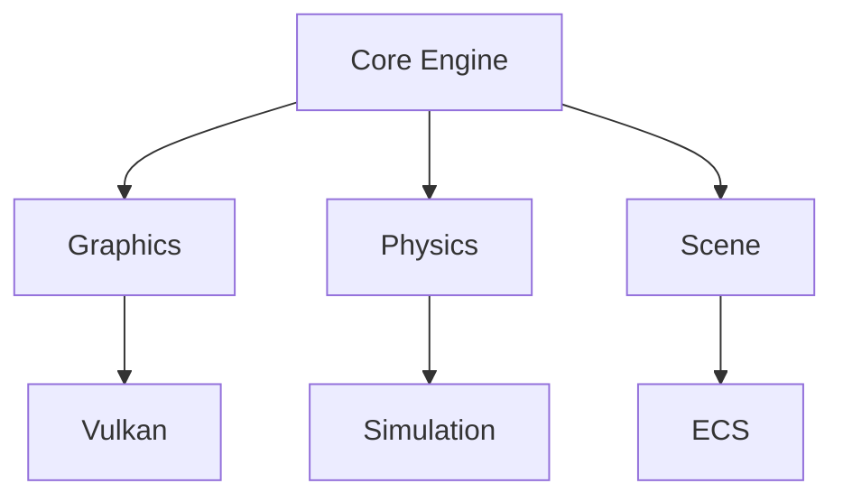

# Game Engine Project 🎮

[](https://www.rust-lang.org)
[](https://vulkano.rs)
[](LICENSE)

A modern game engine written in Rust, featuring Vulkan graphics, physics simulation, and a modular design.

<div align="center">



</div>

## 🚀 Quick Start

```bash
# Clone the repository
git clone https://github.com/username/game-engine.git

# Build the project
cd game-engine
cargo build

# Run examples
cargo run --example basic_window
```

See our [Getting Started Guide](GettingStarted.md) for more details.

## 📚 Documentation

- [Getting Started Guide](GettingStarted.md) - Setup and first steps
- [Technical Reference](TechnicalReference.md) - API and implementation details
- [Directory Structure](DirectoryStructure.md) - Project organization
- [Contributing Guide](Contributing.md) - How to contribute

For full documentation, see our [Documentation Index](index.md).

## ✨ Features

### Graphics Engine

- Vulkan-based rendering pipeline
- Modern shader system
- Material system
- Flexible rendering architecture

### Physics System

- Rigid body dynamics
- Collision detection
- Spatial partitioning
- Constraint solver

### Scene Management

- Entity Component System
- Scene graph hierarchy
- Transform management
- Scene serialization

### Core Systems

- Window management
- Input handling
- Resource management
- Math utilities

## 🔧 Example Usage

```rust
use engine::{Window, Scene, Entity};

fn main() {
    // Initialize engine
    let mut window = Window::new();
    let mut scene = Scene::new();

    // Create entity
    let entity = Entity::builder()
        .with_mesh("models/cube.obj")
        .with_material("materials/metal.mat")
        .with_physics()
        .build();

    scene.add_entity(entity);

    // Main loop
    window.run(move |frame| {
        scene.update();
        scene.render(frame);
    });
}
```

For more examples, see our [Example Code](index.md#example-code) section.

## 🛠️ Development

### Building from Source

```bash
# Debug build
cargo build

# Release build
cargo build --release

# Run tests
cargo test
```

See our [Contributing Guide](Contributing.md) for development setup.

### Project Structure

```
engine/
├── src/          # Source code
├── examples/     # Example code
├── docs/         # Documentation
└── tests/        # Test suites
```

For detailed structure, see [Directory Structure](DirectoryStructure.md).

## 🤝 Contributing

We welcome contributions! See our [Contributing Guide](Contributing.md) for details on:

- Setting up development environment
- Code style guidelines
- Submission process
- Testing requirements

## 📝 Technical Details

For detailed technical information, see our [Technical Reference](TechnicalReference.md).

## 🔗 Navigation

- [Documentation Index](index.md)
- [Getting Started](GettingStarted.md)
- [Technical Reference](TechnicalReference.md)
- [Contributing](Contributing.md)

---

<div align="center">
Made with ❤️ by the Game Engine Team
</div>
