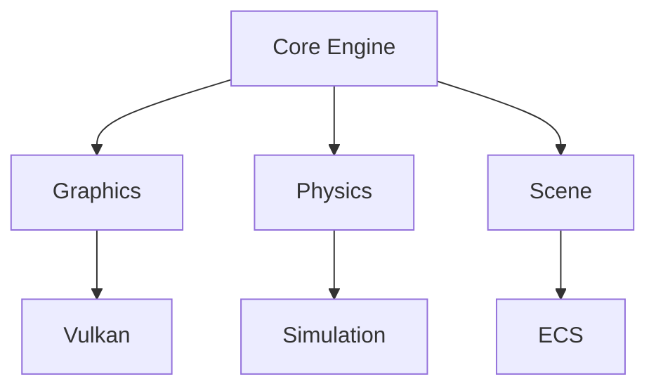
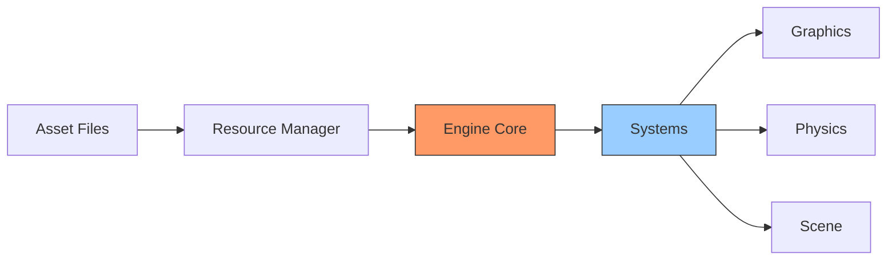

# Game Engine Project 🎮

[](https://www.rust-lang.org)
[](https://vulkano.rs)
[](LICENSE)
[](docs/)

A modern game engine written in Rust, featuring Vulkan graphics, physics simulation, and a modular design.

<div align="center">



</div>

## 🚀 Features

### Graphics Engine

- ⚡ Vulkan-based rendering
- 🎨 Modern shader system
- 📊 Flexible pipeline management
- 🖼️ Advanced material system

### Physics System

- 🔄 Rigid body dynamics
- 💥 Collision detection
- 🌐 Spatial partitioning
- ⚖️ Constraint solver

### Scene Management

- 🎯 Entity Component System
- 📐 Scene graph hierarchy
- 🔄 Transform management
- 🎬 Scene serialization

### Core Systems

- 🎪 Window management
- ⌨️ Input handling
- 📦 Resource management
- 🧮 Math utilities

## 🛠️ Quick Start

```bash
# Clone the repository
git clone https://github.com/username/game-engine.git

# Build the project
cd game-engine
cargo build

# Run examples
cargo run --example basic_window
cargo run --example physics_demo
```

## 📚 Documentation

### Core Guides

| Guide                                      | Description                |
| ------------------------------------------ | -------------------------- |
| [Architecture](guides/architecture.md)     | System design and patterns |
| [Implementation](guides/implementation.md) | Development roadmap        |
| [Technical Details](guides/technical.md)   | Deep technical insights    |

### Component Documentation

| Component | Documentation                            |
| --------- | ---------------------------------------- |
| Graphics  | [Graphics Guide](components/graphics.md) |
| Physics   | [Physics Guide](components/physics.md)   |
| Scene     | [Scene Management](components/scene.md)  |
| UI        | [UI System](components/ui.md)            |

### API Reference

- [Core API](api/core.md)
- [Graphics API](api/graphics.md)
- [Physics API](api/physics.md)
- [Scene API](api/scene.md)

## 🌟 Example Usage

```rust
use engine::{Window, Scene, Entity};

fn main() {
    // Initialize engine
    let mut window = Window::new();
    let mut scene = Scene::new();

    // Create entity
    let entity = Entity::builder()
        .with_mesh("models/cube.obj")
        .with_material("materials/metal.mat")
        .with_physics()
        .build();

    scene.add_entity(entity);

    // Main loop
    window.run(move |frame| {
        scene.update();
        scene.render(frame);
    });
}
```

## 🔧 Development

### Project Structure

```
engine/
├── src/
│   ├── core/      # Core engine systems
│   ├── graphics/  # Rendering and graphics
│   ├── physics/   # Physics simulation
│   ├── scene/     # Scene management
│   └── ui/        # User interface system
├── examples/      # Usage examples
├── docs/         # Documentation
└── tests/        # Test suite
```

### Building From Source

```bash
# Debug build
cargo build

# Release build
cargo build --release

# Run tests
cargo test

# Build documentation
cargo doc --open
```

## 📊 Architecture Overview

<div align="center">



</div>

## 🤝 Contributing

Contributions are welcome! Please check our [Contributing Guide](CONTRIBUTING.md) for guidelines.

1. Fork the repository
2. Create a feature branch
3. Make your changes
4. Submit a pull request

## 📝 License

This project is licensed under the MIT License - see the [LICENSE](LICENSE) file for details.

## 🔗 Links

- [Project Website](https://example.com)
- [Documentation](https://docs.example.com)
- [Issue Tracker](https://github.com/username/game-engine/issues)
- [Discord Community](https://discord.gg/example)

---

<div align="center">
Made with ❤️ by the Game Engine Team
</div>
