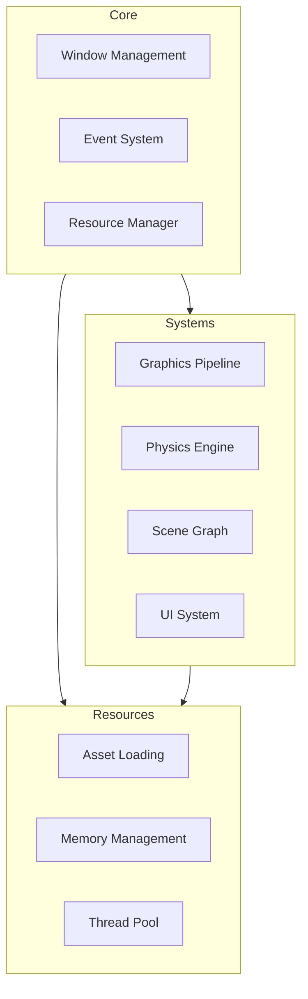

# Technical Reference 🔧

## Engine Architecture

### Core Systems Diagram



## System APIs

### Window Management

```rust
/// Window configuration options
pub struct WindowConfig {
    pub title: String,
    pub width: u32,
    pub height: u32,
    pub vsync: bool,
}

/// Window creation and management
impl Window {
    pub fn new(config: WindowConfig) -> Result<Self, Error>;
    pub fn run<F: FnMut(&mut Frame)>(&mut self, frame_fn: F) -> !;
    pub fn handle_input(&mut self) -> Vec<InputEvent>;
}
```

### Graphics Pipeline

```rust
/// Shader module management
pub struct Shader {
    pub fn new(device: Arc<Device>, code: &[u32], ty: ShaderType) -> Result<Self, Error>;
    pub fn as_ref(&self) -> &Arc<ShaderModule>;
}

/// Render pipeline configuration
pub struct RenderPipeline {
    pub fn new(
        device: Arc<Device>,
        render_pass: Arc<RenderPass>,
        vertex_shader: Arc<ShaderModule>,
        fragment_shader: Arc<ShaderModule>,
        viewport: Viewport,
    ) -> Result<Self, Error>;
}
```

### Physics System

```rust
/// Physics world configuration
pub struct PhysicsConfig {
    pub gravity: Vector3,
    pub timestep: f32,
    pub iterations: u32,
}

/// Physics world management
impl PhysicsWorld {
    pub fn new(config: PhysicsConfig) -> Self;
    pub fn step(&mut self, dt: f32);
    pub fn add_body(&mut self, body: RigidBody) -> BodyHandle;
}
```

### Scene Management

```rust
/// Entity creation and management
impl Scene {
    pub fn new() -> Self;
    pub fn create_entity(&mut self) -> EntityBuilder;
    pub fn query<Q: Query>(&self) -> QueryIter<Q>;
}

/// Component storage
pub trait Component: 'static + Send + Sync {
    fn type_name() -> &'static str;
}
```

## Memory Management

### Resource Allocation

```rust
/// Resource handling
pub struct ResourceManager {
    pub fn load<T: Asset>(&mut self, path: &str) -> Result<Handle<T>, Error>;
    pub fn get<T: Asset>(&self, handle: Handle<T>) -> Option<&T>;
    pub fn unload<T: Asset>(&mut self, handle: Handle<T>);
}

/// Memory pools
pub struct MemoryPool<T> {
    pub fn allocate(&mut self) -> Option<T>;
    pub fn deallocate(&mut self, item: T);
}
```

## Threading Model

### Job System

```rust
/// Job execution
pub struct JobSystem {
    pub fn new(thread_count: usize) -> Self;
    pub fn execute<F>(&self, job: F) where F: FnOnce() + Send + 'static;
    pub fn parallel_for<T, F>(&self, items: &[T], f: F)
    where
        T: Send + Sync,
        F: Fn(&T) + Send + Sync;
}
```

## Error Handling

### Error Types

```rust
#[derive(Debug)]
pub enum Error {
    Graphics(GraphicsError),
    Physics(PhysicsError),
    Resource(ResourceError),
    Scene(SceneError),
}

impl std::error::Error for Error {}
```

## Event System

### Event Handling

```rust
/// Event types
pub enum EngineEvent {
    Window(WindowEvent),
    Input(InputEvent),
    Scene(SceneEvent),
    Resource(ResourceEvent),
}

/// Event dispatch
pub trait EventHandler {
    fn handle(&mut self, event: &EngineEvent);
}
```

## Performance Considerations

### Memory Layout

```
+-----------------+
| Frame Allocator |
+-----------------+
| Resource Cache  |
+-----------------+
| Scene Data      |
+-----------------+
| Static Data     |
+-----------------+
```

### Threading Architecture

```
Main Thread
└─ Render Thread
   └─ Command Buffer Generation
└─ Physics Thread
   └─ Collision Detection
   └─ Constraint Solving
└─ Worker Threads
   └─ Asset Loading
   └─ Scene Updates
```

## Asset Pipeline

### Asset Loading

```rust
/// Asset types
pub trait Asset: Sized + Send + Sync + 'static {
    fn load(path: &str) -> Result<Self, Error>;
    fn unload(&self);
}

/// Asset manager
impl AssetManager {
    pub fn load<T: Asset>(&mut self, path: &str) -> Result<Handle<T>, Error>;
    pub fn get<T: Asset>(&self, handle: &Handle<T>) -> Option<&T>;
}
```

## Configuration System

### Engine Config

```rust
pub struct EngineConfig {
    pub window: WindowConfig,
    pub graphics: GraphicsConfig,
    pub physics: PhysicsConfig,
    pub audio: AudioConfig,
}

impl Engine {
    pub fn new(config: EngineConfig) -> Result<Self, Error>;
    pub fn reconfigure(&mut self, config: EngineConfig) -> Result<(), Error>;
}
```

## Profiling

### Performance Metrics

```rust
pub struct Metrics {
    pub frame_time: Duration,
    pub draw_calls: u32,
    pub triangle_count: u32,
    pub physics_time: Duration,
    pub memory_usage: usize,
}

impl Engine {
    pub fn get_metrics(&self) -> Metrics;
}
```

## Debug Tools

### Debug Rendering

```rust
pub trait DebugDraw {
    fn draw_line(&mut self, start: Vector3, end: Vector3, color: Color);
    fn draw_box(&mut self, min: Vector3, max: Vector3, color: Color);
    fn draw_sphere(&mut self, center: Vector3, radius: f32, color: Color);
}
```

This technical reference provides a comprehensive overview of the engine's systems and APIs. For detailed implementation examples, see the [Examples](../../examples/) directory.
