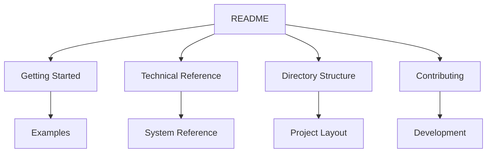

# Game Engine Documentation Index 📚

## Quick Links

| Document                                     | Description                   | Status |
| -------------------------------------------- | ----------------------------- | ------ |
| [README](README.md)                          | Project overview and features | ✅     |
| [Getting Started](GettingStarted.md)         | Setup and first steps         | ✅     |
| [Technical Reference](TechnicalReference.md) | API and system details        | ✅     |
| [Directory Structure](DirectoryStructure.md) | Project organization          | ✅     |
| [Contributing](Contributing.md)              | Contribution guidelines       | ✅     |

## Documentation Map



## Core Systems Documentation

### Graphics System

- Engine initialization
- Vulkan integration
- Shader system
- Render pipeline
- Resource management

### Physics System

- Physics world
- Collision detection
- Rigid body dynamics
- Constraint system

### Scene Management

- Entity Component System
- Scene graph
- Transform hierarchy
- Component lifecycle

### Resource Management

- Asset loading
- Resource caching
- Memory management
- Asset pipeline

## Example Code

### Basic Examples

```rust
// Window Creation
use engine::{Window, WindowConfig};

fn main() {
    let window = Window::new(WindowConfig::default());
    window.run(|frame| {
        // Frame update logic
    });
}
```

### Graphics Example

```rust
// Basic Rendering
use engine::{Graphics, Mesh, Shader};

fn setup_graphics(window: &Window) {
    let graphics = Graphics::new(window);
    let mesh = Mesh::cube();
    let shader = Shader::default();

    graphics.draw(mesh, shader);
}
```

### Physics Example

```rust
// Physics Setup
use engine::{PhysicsWorld, RigidBody};

fn setup_physics() {
    let mut world = PhysicsWorld::new();
    let body = RigidBody::new()
        .with_mass(1.0)
        .with_position([0.0, 1.0, 0.0]);

    world.add_body(body);
}
```

## Reference Documentation

### Core Systems

- Window management
- Event handling
- Resource management
- Threading model

### Graphics Pipeline

- Device management
- Swapchain handling
- Pipeline creation
- Shader compilation

### Physics Engine

- Collision detection
- Rigid body simulation
- Constraint solving
- Physics materials

### Scene System

- Entity management
- Component storage
- System updates
- Scene serialization

## Development Resources

### Getting Started

1. [Engine Setup](GettingStarted.md)
2. [Basic Usage](GettingStarted.md#first-steps)
3. [Project Structure](DirectoryStructure.md)

### Development Guide

1. [Contributing](Contributing.md)
2. [Code Style](Contributing.md#code-style)
3. [Testing](Contributing.md#testing)

## Support

### Common Tasks

- Engine initialization
- Asset loading
- Scene setup
- Physics configuration

### Best Practices

- Resource management
- Performance optimization
- Memory handling
- Error handling

---

<div align="center">

**[Back to Top](#game-engine-documentation-index-)**

Documentation last updated: February 18, 2025

</div>
