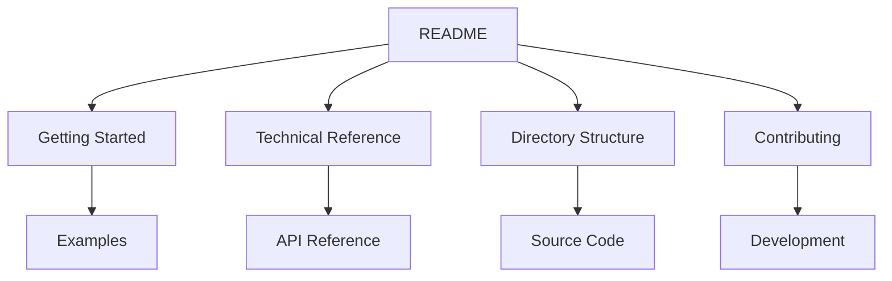

# Game Engine Documentation Index 📚

## Quick Links

| Document                                     | Description                   | Status |
| -------------------------------------------- | ----------------------------- | ------ |
| [README](README.md)                          | Project overview and features | ✅     |
| [Getting Started](GettingStarted.md)         | Setup and first steps         | ✅     |
| [Technical Reference](TechnicalReference.md) | API and system details        | ✅     |
| [Directory Structure](DirectoryStructure.md) | Project organization          | ✅     |
| [Contributing](Contributing.md)              | Contribution guidelines       | ✅     |

## Documentation Map

## Core Systems Documentation

### Graphics System

- [Vulkano Integration](../guides/vulkano_integration.md)
- [Shader System](../guides/shader_system.md)
- [Render Pipeline](../guides/render_pipeline.md)

### Physics System

- [Physics Overview](../guides/physics_overview.md)
- [Collision Detection](../guides/collision_detection.md)
- [Physics Integration](../guides/physics_integration.md)

### Scene Management

- [ECS Architecture](../guides/ecs_architecture.md)
- [Scene Graph](../guides/scene_graph.md)
- [Component System](../guides/component_system.md)

### Resource Management

- [Asset Loading](../guides/asset_loading.md)
- [Resource Caching](../guides/resource_caching.md)
- [Memory Management](../guides/memory_management.md)

## Examples

### Basic Examples

1. [Window Creation](../../examples/basic_window.rs)
2. [Event Handling](../../examples/event_loop.rs)
3. [Input Processing](../../examples/input_handling.rs)

### Advanced Examples

1. [Physics Simulation](../../examples/physics_demo.rs)
2. [3D Rendering](../../examples/rendering/basic_triangle.rs)
3. [UI System](../../examples/ui_demo.rs)

## API Reference

- [Core API](../api/core.md)
- [Graphics API](../api/graphics.md)
- [Physics API](../api/physics.md)
- [Scene API](../api/scene.md)

## Development Resources

### Guides

- [Code Style Guide](../guides/code_style.md)
- [Testing Guide](../guides/testing.md)
- [Performance Guide](../guides/performance.md)

### Tools

- [Build Scripts](../tools/build.md)
- [Asset Pipeline](../tools/asset_pipeline.md)
- [Debugging Tools](../tools/debugging.md)

## Community

- [Discord Server](https://discord.gg/example)
- [GitHub Discussions](https://github.com/username/game-engine/discussions)
- [Issue Tracker](https://github.com/username/game-engine/issues)

## Version History

- [Changelog](../../CHANGELOG.md)
- [Migration Guide](../guides/migration.md)
- [Breaking Changes](../guides/breaking_changes.md)

## Contributing

1. [How to Contribute](Contributing.md)
2. [Development Setup](GettingStarted.md)
3. [Code Review Process](../guides/code_review.md)

## Support

- [FAQ](../support/faq.md)
- [Troubleshooting](../support/troubleshooting.md)
- [Known Issues](../support/known_issues.md)

---

**[Back to Top](#game-engine-documentation-index-)**

Documentation last updated: February 18, 2025

