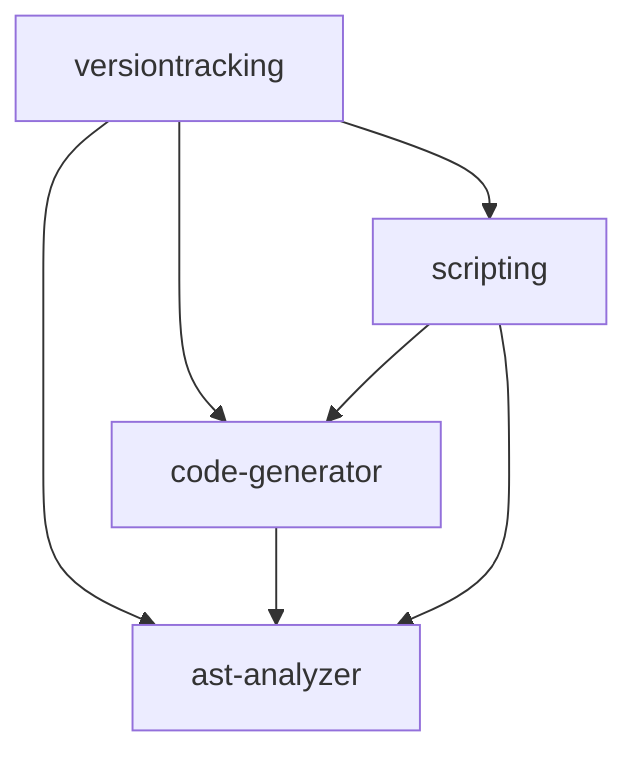

# Version Tracking Tools Directory Structure

```
versiontracking/
├── src/                         # Main library code
│   ├── lib.rs                   # Public API and re-exports
│   ├── error.rs                 # Error types
│   └── scripting/              # Scripting system
│       ├── mod.rs              # Scripting module interface
│       ├── config.rs           # Configuration handling
│       ├── interpreter.rs      # Script execution
│       └── parser.rs           # Script parsing
│
├── crates/                      # Workspace crates
│   ├── ast-analyzer/           # AST analysis functionality
│   │   ├── src/
│   │   │   ├── lib.rs         # Analyzer public API
│   │   │   ├── comparison.rs  # Breaking change detection
│   │   │   ├── extraction.rs  # AST information extraction
│   │   │   ├── pattern.rs     # Pattern detection
│   │   │   └── visitor.rs     # AST traversal
│   │   └── Cargo.toml
│   │
│   └── code-generator/         # Code generation functionality
│       ├── src/
│       │   ├── lib.rs         # Generator public API
│       │   ├── generator.rs   # Code generation orchestration
│       │   ├── transform.rs   # Code transformations
│       │   ├── template.rs    # Code templates
│       │   └── patterns.rs    # Generation patterns
│       └── Cargo.toml
│
├── docs/                        # Documentation
│   ├── ScriptingReference.md   # Scripting system guide
│   ├── CodeGenerationPatterns.md # Pattern documentation
│   └── ExtendingTheTools.md    # Extension guide
│
├── examples/                    # Example code
│   ├── complete_workflow.rs    # Full workflow example
│   ├── scripts/               # Example scripts
│   │   └── examples.script    # Common script examples
│   └── demo/                  # Demo project
│       ├── run_demo.sh       # Demo script
│       └── README.md         # Demo documentation
│
├── benches/                     # Benchmarks
│   └── benchmarks.rs          # Performance tests
│
├── tests/                       # Integration tests
│   ├── integration_tests.rs    # Main test suite
│   └── common/                # Shared test utilities
│       └── mod.rs            # Test helpers
│
├── .github/                     # GitHub configuration
│   └── workflows/             # CI/CD workflows
│       └── ci.yml            # CI pipeline
│
├── Cargo.toml                  # Workspace manifest
├── CHANGELOG.md                # Version history
├── CONTRIBUTING.md             # Contribution guide
├── LICENSE                     # License information
├── README.md                   # Project overview
└── RELEASE_CHECKLIST.md        # Release process
```

## Module Dependencies



## Feature Organization

### Core Features

- AST analysis (`ast-analyzer`)
- Code generation (`code-generator`)
- Breaking change detection
- Pattern recognition

### Optional Features

- Async support (`async` feature)
- Scripting system (`scripting` feature)
- Advanced templates (`templates` feature)
- Custom transforms (`transforms` feature)

## Documentation Organization

1. User Documentation

   - README.md: Project overview and quick start
   - docs/: Detailed guides and references
   - examples/: Working examples

2. Developer Documentation

   - CONTRIBUTING.md: Development guidelines
   - RELEASE_CHECKLIST.md: Release process
   - Internal module documentation

3. API Documentation
   - Public API documentation in lib.rs
   - Feature-specific documentation
   - Example code snippets

## Test Organization

1. Unit Tests

   - Located alongside code
   - Feature-specific tests
   - Error case coverage

2. Integration Tests

   - Full workflow tests
   - Cross-feature interaction
   - Edge cases

3. Benchmarks
   - Performance baselines
   - Regression tests
   - Scaling tests

## Asset Organization

1. Templates

   - Code generation templates
   - Documentation templates
   - Script templates

2. Configuration

   - Default configurations
   - Feature flags
   - Environment settings

3. Scripts
   - Example scripts
   - Demo scripts
   - Test scripts

## Main Entry Points

1. Library Users

   ```rust
   use versiontracking::{Analyzer, CodeGenerator};
   ```

2. CLI Users

   ```bash
   vtrack analyze src/
   vtrack generate --kind struct --name MyStruct
   ```

3. Script Users
   ```
   // version-tracking.script
   analyze src/ {
       detect patterns
   }
   ```

## Extension Points

1. Custom Patterns

   - Pattern trait implementation
   - Pattern registration

2. Custom Transforms

   - Transform trait implementation
   - Transform pipeline integration

3. Custom Templates

   - Template definition
   - Template registration

4. Script Extensions
   - Command registration
   - Custom interpreters
